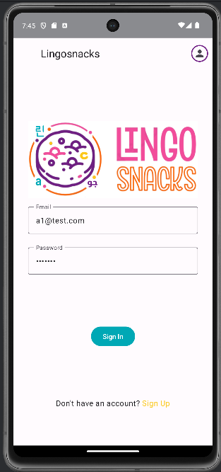

# LingoSnacks App - Phase 2

## Project Overview

LingoSnacks was a part of a group project for my Mobile App Development course at Qatar University. It is a mobile application designed to aid language learning through interactive, game-like activities for students and a learning package editor for teachers. This project is the Phase 2 implementation, where both the Learning Package Editor and LingoSnacks App are integrated into a single solution. The app allows teachers to create and manage learning packages, while students can download these packages and engage in various interactive learning activities such as flashcards, unscramble sentences, and matching words with definitions.

## Features

### Teacher Features (Learning Package Editor)
- **Login/Sign-Up**: Allows teachers to log in or create an account.
- **Package Management**: Teachers can list, search, edit, and delete learning packages.
- **Add/Update Words, Definitions, and Sentences**: Teachers can add/update words and associate them with definitions and example sentences.
- **Attach Multimedia**: Teachers can attach multimedia content (images, videos, or web links) to words or sentences.
- **Publish Packages**: Teachers can publish learning packages for students to use.

### Student Features (LingoSnacks App)
- **Login/Sign-Up**: Students can optionally create an account to rate learning packages.
- **Search and Download Learning Packages**: Students can search and download learning packages to use in the app.
- **Interactive Learning Activities**:
  - **Flashcards**: Play flashcards based on the content of the package.
  - **Unscramble Sentences**: Reorder words to form meaningful sentences.
  - **Match Word & Definition**: Match words to their correct definitions.
- **Track Scores**: Students can view their scores from different games.
- **Rate Learning Packages**: Students can rate the learning packages after using them.

## Technology Used
- **Firebase Authentication**: For user authentication (sign up and login).
- **Firebase Firestore**: For storing and retrieving learning packages and user data.
- **Firebase Cloud Storage**: For storing multimedia content (images, videos).
- **Room Database**: For local storage and offline usage of learning packages and user data.
- **MVVM Architecture**: Used for separating the UI and data layers to ensure clean and maintainable code.

## Database Design

- **Firestore**: Data is stored in Firestore for online access, including learning packages, multimedia content, and user details.
- **SQLite Database**: Local storage is used for offline usage, ensuring that students can use the app without an internet connection.

